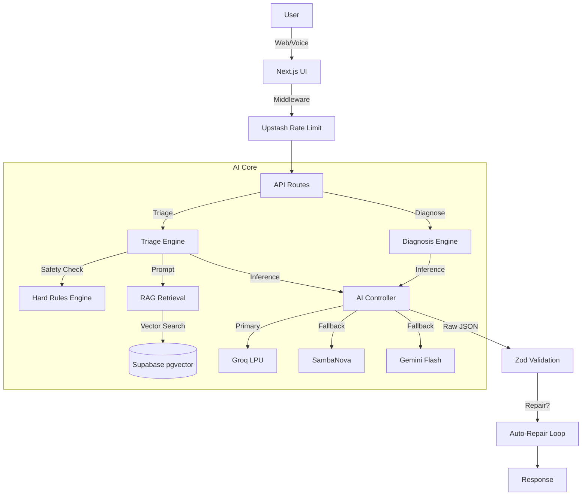

# AI Medix Architecture

## System Diagram

## Data Flow (Triage)
1. **Input**: Symptoms, Age, Gender, Pregnant(Boolean)
2. **Pre-Check**: Hard regex rules check for "Chest Pain", "Suicide", "Pregnancy"
   - *If Match*: Return IMMEDIATE EMERGENCY response
3. **Retrieval**: Embed symptoms → Query Supabase → Retrieve top 5 chunks
4. **Inferece**: Construct prompt with Context + Patient Data → Call Groq Llama 3.3
5. **Validation**: Validate JSON against `TriageSchema` → If fail, Auto-Repair
6. **Output**: Urgency Level, Red Flags, Citations

## Tech Stack
- **Frontend**: Next.js 16, React 19
- **AI**: Groq (Llama 3.3), SambaNova (Llama 3.1 405B), Gemini 1.5
- **Database**: Supabase (Postgres + pgvector)
- **Cache/Limit**: Upstash Redis
- **Auth**: NextAuth (Google)
